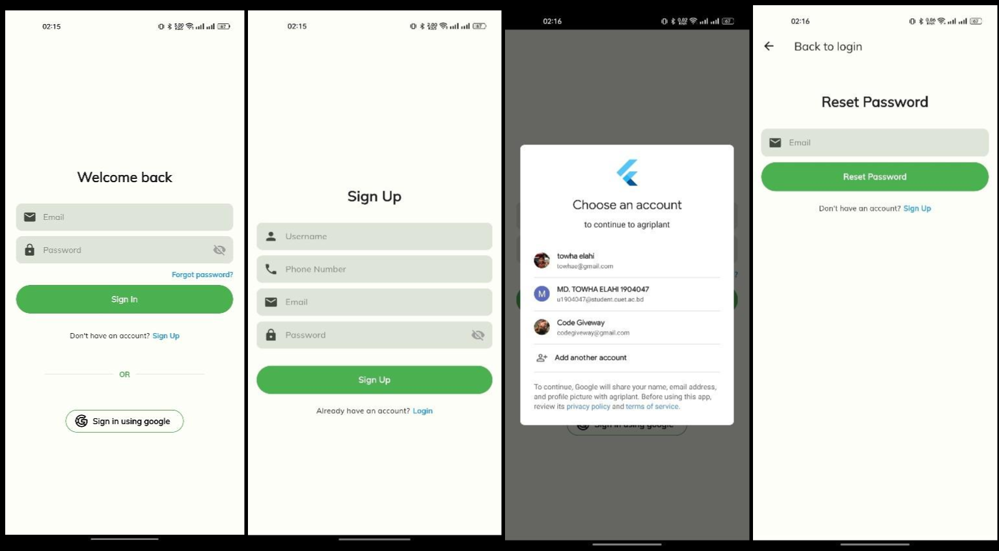
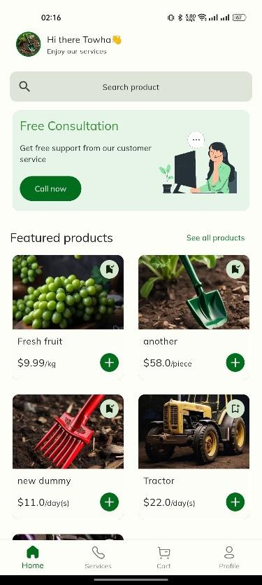
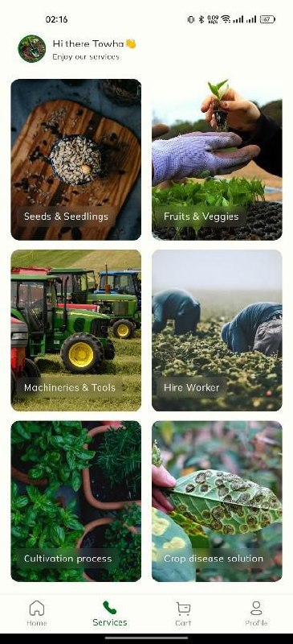

# 🌾 AgriPlant - An Agricultural Mobile App

AgriPlant is a smart mobile solution to modernize farming. It connects users with seeds, tools, workers, crop guidance, and a machine learning-based crop disease detection system — all from one easy-to-use platform.

<p align="center">
    
  <!-- Replace with actual GIF or image -->
</p>

---

## 📲 Features

### 🔐 User Authentication
- Email/password and Google Sign-In
- Password reset support  
  

---

### 🏠 Home Section
- Product search bar  
- Direct consultation call  
- Featured product display  
  

---

### 🛠 Services
Provides six services:
- 🌱 Buy Seeds & Seedlings  
- 🍎 Buy Fruits & Vegetables  
- ⚙️ Rent Machineries & Tools  
- 🧑‍🌾 Hire Workers  
- 📘 View Cultivation Guides  
- 🧪 Detect Crop Diseases with ML  
  

---

### 🛒 Cart & Checkout
- Add and manage items  
- Maintain quantity  
- Place secure orders  
  .png).

---

### 👤 Profile & Admin
- View/Edit profile  
- Track orders & bookmarks  
- Admin: Add/manage products and orders  
  .png)

---

### 🧠 ML-Based Disease Detection
- Upload crop images  
- Get real-time disease diagnosis  
- Save diagnosis history  
  .png)

---

### 📋 Additional Pages
- Splash & Welcome  
- Product List & Detail  
- Order Status & Bookmarks  
  .png)

---

## ⚙️ Tech Stack

- **Flutter** – Mobile App Framework  
- **Firebase** – Auth, Firestore, Storage  
- **TensorFlow/Keras** – ML Crop Disease Detection  
- **MongoDB** – (if used for admin or storage)  
- **Blender** – UI assets or 3D visuals (optional)  
- **pub.dev packages** – Image picker, state management, animations

---

## 🚀 Getting Started

To clone and run this project:

```bash
git clone https://github.com/your-username/AgriPlant.git
cd AgriPlant
flutter pub get
flutter run
```

---

## 🖼️ Demo

<p align="center">
  
  <!-- Replace 'feature_flow.gif' with your actual demo filename -->
</p>

---

## 👨‍💼 Admin Panel Features

- 🧾 Add/edit/delete products  
- 📦 Track and manage user orders  
- 👥 Manage users and roles

---

## 📌 Conclusion

AgriPlant blends innovation with agriculture. From disease detection to product ordering, it supports smarter farming and builds a bridge between rural needs and modern technology.

---

## ✍️ Author

- [Towha Elahi](https://github.com/towhaEL)

---

## 📬 Contact

- **Email**: [towhae@gmail.com](mailto:towhae@gmail.com)  
- **LinkedIn**: [linkedin.com/in/towhae](https://www.linkedin.com/in/towhae)

---

## ⭐ Show Your Support

If you like this project, leave a ⭐ and share it with your peers!
